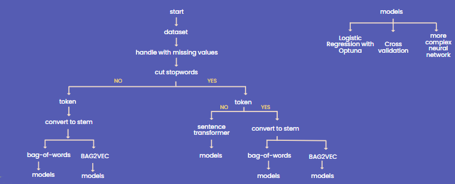

# Fake_News_Detection

The project was created during the Intermediate Data Science course. It contains a classification problem. Fake News Detection using deep learning, PyTorch, Optuna. 

### Introduction

The spread of fake news has become a major issue in today's world. False information spreads rapidly through social media and other online platforms, leading to widespread misinformation and confusion. Fake news can have serious implications, such as spreading misinformation, influencing public opinion, and even affecting election results. Therefore, it is important to have a reliable and accurate system for identifying fake news.

### Goal

The aim of this project is to develop a machine learning model that can detect fake news.

### How?

There are 3 datasets. All come from [kaggle.com](https://www.kaggle.com/):
1. [WELFake_Dataset](https://www.kaggle.com/datasets/saurabhshahane/fake-news-classification)
2. [Fake & Real](https://www.kaggle.com/datasets/clmentbisaillon/fake-and-real-news-dataset?select=True.csv)
3. [Fake news net](https://www.kaggle.com/datasets/algord/fake-news)

Separate notebooks were created for each dataset. Notebooks include data loading, preprocessing and modeling. Preprocessing was done in several ways, and each of them was tested on 3 different models. Below is the data processing and modeling algorithm.

### Final presentation
The presentation [final_presentation_fake_news_detection.pdf](https://github.com/michalinahulak/Fake_News_Detection/blob/main/final_presentation_fake_news_detection.pdf) delves into the problem of fake news and my approach to detecting it. I discuss the various techniques and models used in the project, as well as the evaluation metrics and results achieved. It's an informative and engaging presentation that offers valuable insights into the world of fake news detection.

### The repository contains:

* final_presentation_fake_news_detection.pdf - - include project presentation which provides an overview of the project's goals, methods, and results
* 1_WELFake_Fake_News.ipynb - - include notebook with preprocessing and modeling for WELFake_News dataset
* 2_FakeandReal.ipynb - - include notebook with preprocessing and modeling for Fake_and_real dataset
* 3_FakeNewsnet.ipynb - - include notebook with preprocessing and modeling for Fake_news_net dataset
* fakeandreal_pandasprofiling.html - - include pandas profiler report in html format for fake & real dataset
* WELFake_Fake_News_pandasprofiling.html - - include pandas profiler report in html format for WELFake_News dataset
* functions.py - - include functions for preprocessing datasets
* modeling_scripts.py - - include functions for modeling

### How to Run the Project?
To open the project, use the git clone command or download the selected files.
