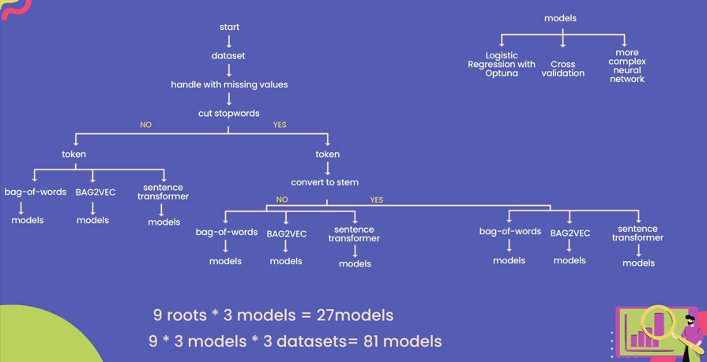

# Fake_News_Detection

The project was created during the Advanced Data Science course. It contains a classification problem. Fake News Detection using deep learning, PyTorch, Optuna. 

There are 3 datasets. All come from [kaggle.com](https://www.kaggle.com/):
1. [WELFake_Dataset](https://www.kaggle.com/datasets/saurabhshahane/fake-news-classification)
2. [Fake & Real](https://www.kaggle.com/datasets/clmentbisaillon/fake-and-real-news-dataset?select=True.csv)
3. [Fake news net](https://www.kaggle.com/datasets/algord/fake-news)

Separate notebooks were created for each dataset. Notebooks include data loading, preprocessing and modeling. Preprocessing was done in several ways, and each of them was tested on 3 different models. Below is the data processing and modeling algorithm.

